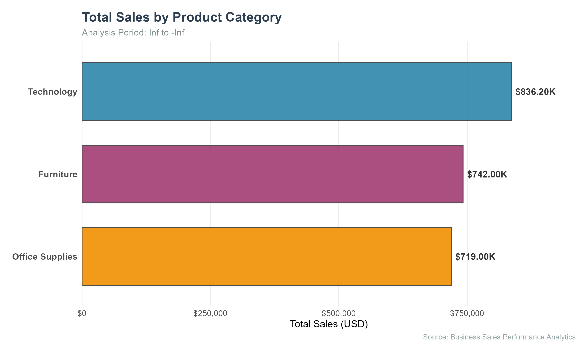
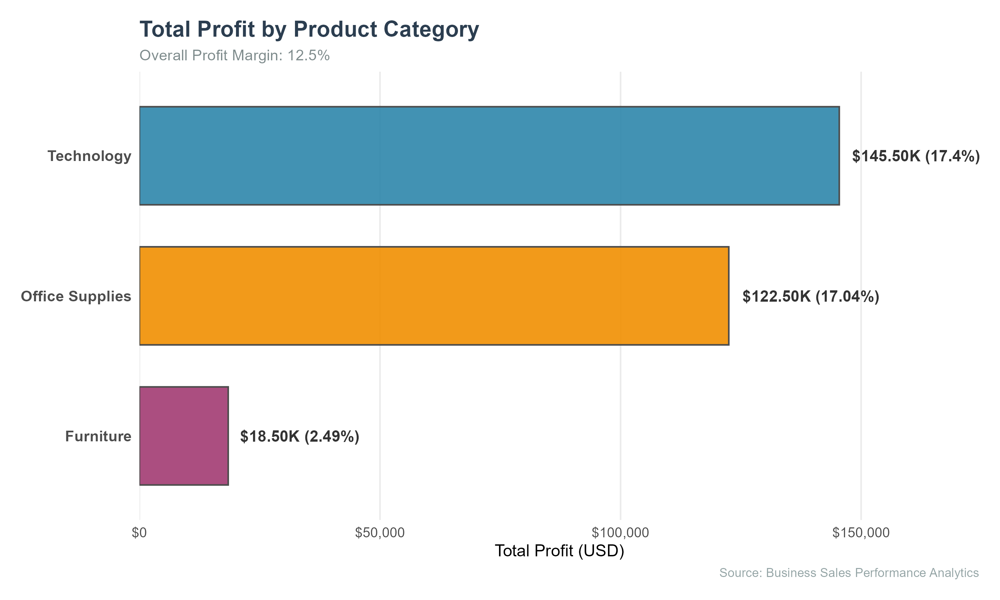
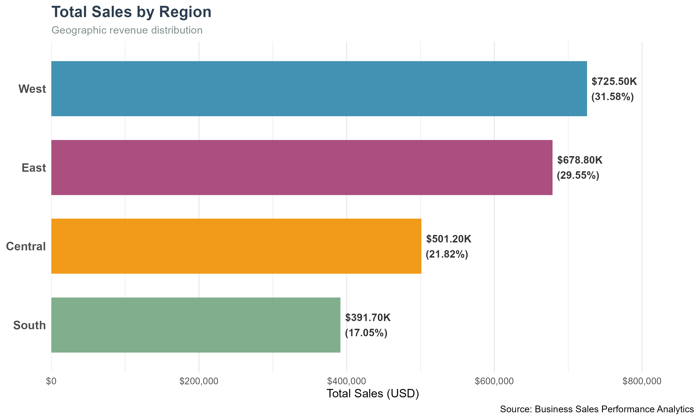
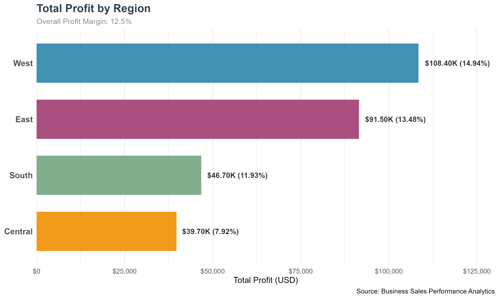
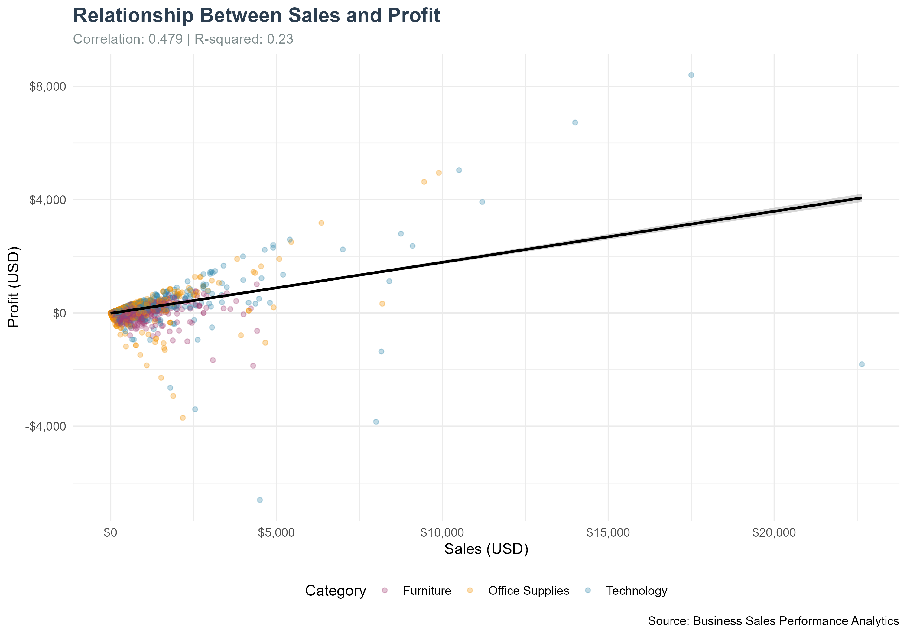
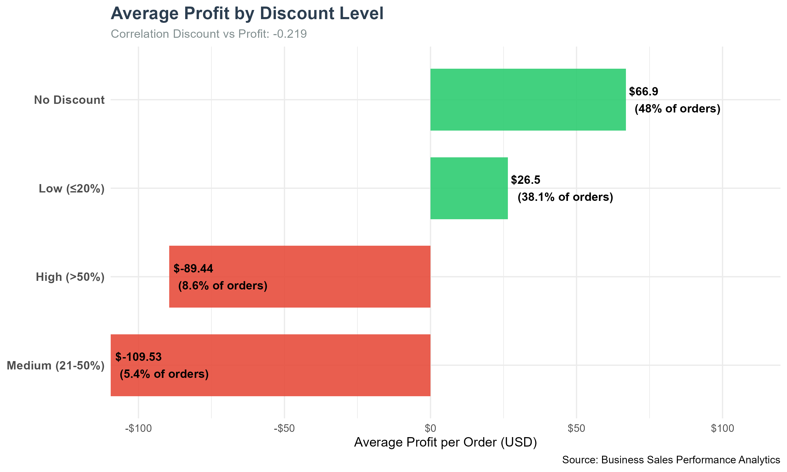
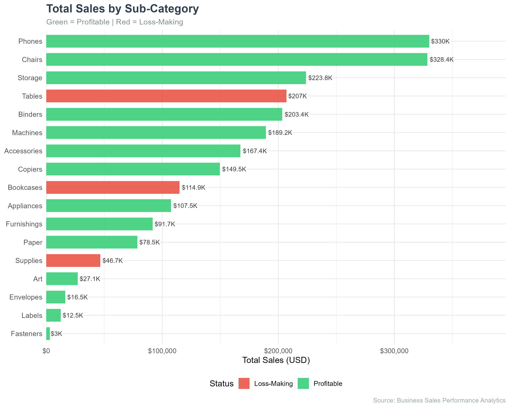
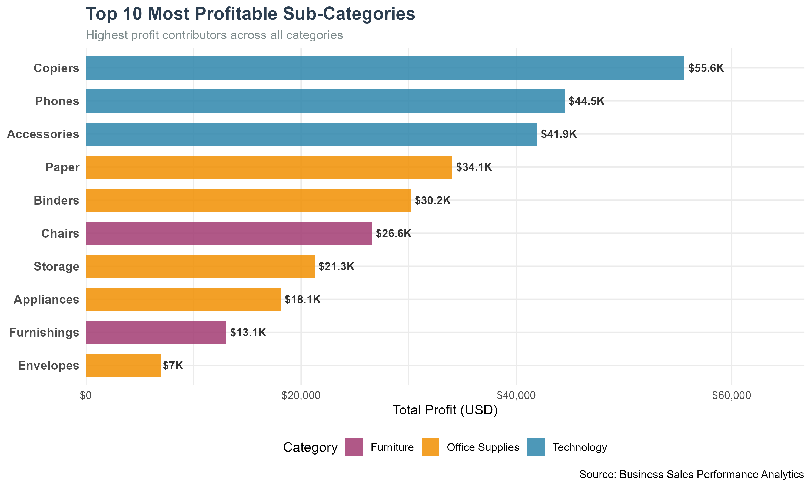
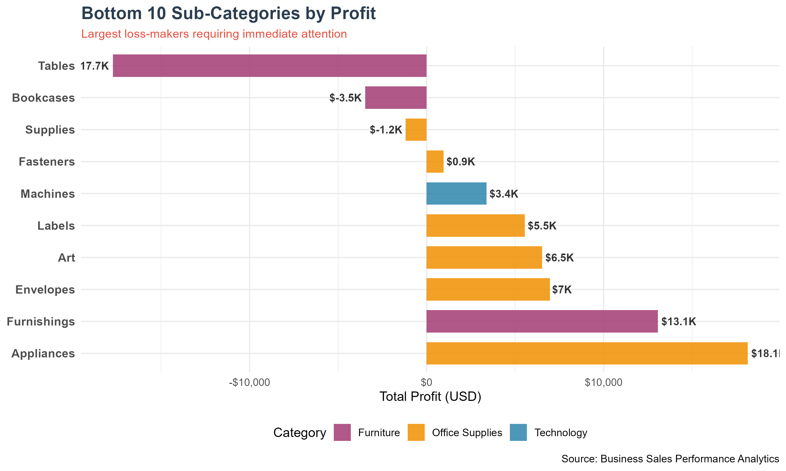

# FUTURE_DS_01

## Business Sales Performance Analytics

**Future Interns — Data Science & Analytics Task 1**

---

## 📊 Project Overview

This project analyzes **9,994 retail transactions** from the Superstore dataset to identify revenue trends, top-performing products, profitable categories, and regional performance. The objective is to generate **actionable business insights** that can support strategic decision-making and improve profitability.

---

## 🎯 Business Questions Answered

1. ✅ Which products generate the most revenue?
2. ✅ How do sales change over time?
3. ✅ Which categories are most profitable?
4. ✅ Which regions perform best?
5. ✅ What recommendations can improve business growth?

---

## 📈 Key Performance Indicators

| Metric | Value |
|--------|-------|
| **Total Sales** | **$2,297,201** |
| **Total Profit** | **$286,397** |
| **Profit Margin** | **12.47%** |
| Total Orders | 5,009 |
| Total Customers | 793 |
| Average Order Value | $458.61 |

---

## 🔍 Key Findings

### Category Performance
- ⭐ **Technology** leads: $836K sales, $145K profit, 17.4% margin
- ⚠️ **Furniture** warning: $742K sales but only $18K profit (2.49% margin)
- ✅ **Office Supplies**: $719K sales, $122K profit, 17.0% margin

### Regional Analysis
- 🏆 **West region** dominates: 31.6% of sales, 37.9% of profit, 14.9% margin
- ⚠️ **Central region** underperforms: 7.92% margin (half of West)
- ❌ **South region** critical: Sales-profit correlation = 0.007

### Statistical Evidence
- **ANOVA confirms** category and regional differences are statistically significant (p < 0.05)
- **Correlation:** Sales explains only 23% of profit variation
- **Discount impact:** 14% of orders with high discounts lose $98/order on average
- **Regression:** Every $1 in sales generates approximately $0.18 in profit

---

## 💼 Business Recommendations

### Immediate Actions (0-3 months)
1. **Cap discounts at 20%** — 14% of orders with high discounts destroy value
2. **Investigate Furniture pricing** — 2.49% margin is unsustainable
3. **Audit Texas, Ohio, Pennsylvania** — High sales but significant losses

### Strategic Initiatives (3-12 months)
4. **Replicate West region model** — 14.9% margin best practice
5. **Prioritize Technology inventory** — $70 more profit per order than Furniture
6. **Restructure South region** — Sales and profit are unrelated

### Estimated Impact
Implementing recommendations could add **$46K–$92K in annual profit**.

---

## 🛠️ Tools & Techniques

| Technique | Purpose |
|-----------|---------|
| **R / tidyverse** | Data cleaning, transformation, analysis |
| **ggplot2** | Professional data visualizations |
| **ANOVA + Tukey HSD** | Statistical significance testing |
| **Linear Regression** | Profit driver modeling |
| **Correlation Analysis** | Sales-Profit-Discount relationships |
| **R Markdown / LaTeX** | Professional report generation |
| **Git / GitHub** | Version control and portfolio |

---
---

## 📸 Visualizations

### Category Performance

### Regional Analysis

### Statistical Analysis

### Sub-Category Deep Dive

---

## 📝 Methodology

1. **Data Cleaning** — Missing values, duplicates, date standardization
2. **Exploratory Analysis** — KPI calculation, trend identification
3. **Category Analysis** — Revenue and profit drivers by category
4. **Sub-Category Analysis** — Identify loss-makers and top performers
5. **Regional Analysis** — Geographic performance patterns
6. **Statistical Analysis** — Correlation, ANOVA, Regression, Discount Impact
7. **Business Recommendations** — Evidence-based strategic guidance

---

## 🎓 Skills Demonstrated

- Data cleaning and preparation
- Business-focused KPI analysis
- Statistical inference and hypothesis testing
- Professional data visualization (ggplot2)
- Insight generation and business storytelling
- Reproducible research practices
- Git version control and portfolio development

---

## 📞 Connect

**Author:** Thembinkosi Phama  
**Repository:** [FUTURE_DS_01](https://github.com/TS-PHAMA/FUTURE_DS_01)  
**Internship:** Future Interns — Data Science & Analytics Track

---

*© 2026 — Future Interns Data Science & Analytics Task 1*
